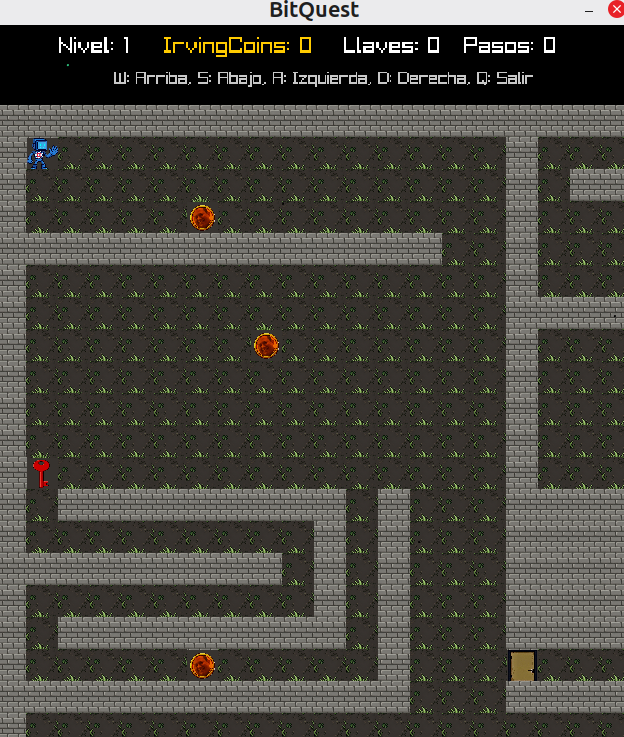
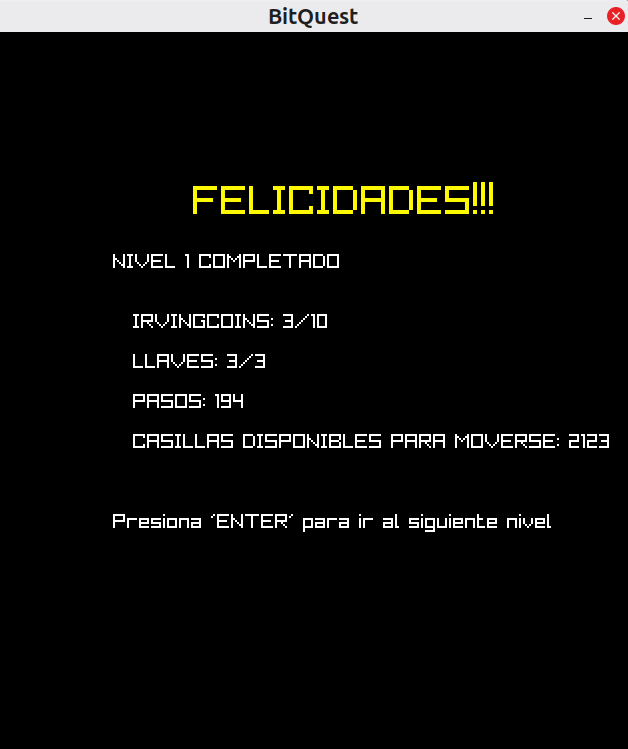

# BitQuest

Videojuego 2D desarrollado en **C** y **NASM x86-64** utilizando la biblioteca gráfica **Raylib**.

BitQuest es una aventura de exploración basada en mapas donde el jugador debe recorrer laberintos, recolectar monedas, encontrar llaves, abrir puertas y localizar la salida para completar cada nivel.

El proyecto combina programación de alto y bajo nivel mediante la integración de módulos desarrollados en C con rutinas implementadas en lenguaje ensamblador NASM x86-64. Esta integración permite utilizar ensamblador para operaciones relacionadas con el procesamiento de mapas, validación de movimientos, detección de objetos y cálculo de puntuaciones, mientras que C se encarga de la lógica general del juego y la interacción con la biblioteca gráfica Raylib.

<p align="center">
    
</p>

## Tecnologías Utilizadas

- C
- NASM x86-64
- Raylib
- GCC
- Bash
- Linux

## Características

- Arquitectura modular basada en múltiples componentes independientes.
- Integración entre C y lenguaje ensamblador NASM x86-64.
- Exploración de mapas de gran tamaño con ventana dinámica de visualización.
- Sistema de múltiples niveles con dificultad progresiva.
- Carga de mapas desde archivos externos.
- Sistema de monedas, llaves, puertas y salidas.
- Registro de estadísticas del jugador.
- Música de fondo y recursos gráficos mediante Raylib.
- Compilación automatizada mediante script Bash.
- Separación entre lógica, gráficos y procesamiento de bajo nivel. 

## Mecánicas del Juego

Durante la partida el jugador deberá:

- Explorar el mapa.
- Recolectar monedas.
- Obtener llaves.
- Abrir puertas bloqueadas.
- Encontrar la salida del nivel.
- Completar todos los niveles disponibles.

<p align="center">
    
</p>

### Controles

```tabla
| Tecla |            Acción            |
|-------|------------------------------|
|   W   |     Mover hacia arriba       |
|   A   |   Mover hacia la izquierda   |
|   S   |      Mover hacia abajo       |
|   D   |    Mover hacia la derecha    |
|   Q   |      Salir del juego         |
```

## Aspectos Técnicos Destacados

BitQuest integra diversas funciones desarrolladas en NASM para complementar la lógica implementada en C.

Entre ellas:

- Conteo de objetos dentro del mapa.
- Validación de movimientos.
- Detección de objetos interactivos.
- Cálculo del puntaje final.
- Actualización de mapas.
- Conteo de celdas transitables.

El juego además incorpora:

- Manejo dinámico de memoria.
- Procesamiento de matrices bidimensionales.
- Carga de niveles desde archivos.
- Renderizado de texturas.
- Reproducción de audio.
- Arquitectura modular basada en archivos fuente especializados. 

## Estructura del Proyecto

```text
BitQuest/
│
├── screenshots/
│   ├── inicio.png
│   └── nivel_completado.png
│
├── assets/
│   ├── audio/
│   │   └── musicaFondo.mp3
│   │
│   ├── images/
│   │   ├── Jugador.png
│   │   ├── Llave.png
│   │   ├── Moneda.png
│   │   ├── Pared.png
│   │   ├── Piso.png
│   │   ├── Puerta.png
│   │   └── Salida.png
│   │
│   └── maps/
│       ├── mapa1.txt
│       ├── mapa2.txt
│       ├── mapa3.txt
│       └── mapa4.txt
│
├── docs/
│   └── Documentacion-Tecnica-BitQuest.pdf
│
├── src/
│   ├── main.c
│   ├── juego.c
│   ├── juego.h
│   ├── graficos.c
│   ├── graficos.h
│   ├── mapas.h
│   └── procesos.asm
│
├── build.sh
├── .gitignore
└── README.md
```

## Compilación

Dar permisos de ejecución al script:

```bash
chmod +x build.sh
```

Ejecutar:

```bash
./build.sh
```

El script realiza:

1. Compilación de rutinas NASM.
2. Compilación de archivos C.
3. Enlace de todos los módulos.
4. Generación del ejecutable final.

## Ejecución

Una vez compilado el proyecto:

```bash
./bin/BitQuest
```

## Recursos del Juego

### Elementos del Mapa

```tabla
| Símbolo | Descripción  |
|---------|--------------|
|    P    |   Jugador    |
|    .    | Camino libre |
|    #    |    Pared     |
|    M    |    Moneda    |
|    K    |    Llave     |
|    D    |    Puerta    |
|    E    |    Salida    |
```

## Conocimientos Aplicados

Durante el desarrollo del proyecto se aplicaron conocimientos en:

- Programación en C.
- Programación en ensamblador NASM x86-64.
- Integración entre C y ensamblador.
- Desarrollo de videojuegos.
- Manejo de matrices bidimensionales.
- Gestión dinámica de memoria.
- Carga de archivos externos.
- Desarrollo modular de software.
- Compilación y enlazado de múltiples módulos.
- Programación gráfica mediante Raylib.

## Documentación

La documentación técnica completa del proyecto se encuentra disponible en:

```text
docs/Documentacion-Tecnica-BitQuest.pdf
```

## Autores

- Suárez Vega, Vladimir
- Zermeño Ojeda, Paola Sarahi
- Zermeño Ojeda, Diana Valeria

## Historial del Proyecto

- Desarrollo original: **mayo-junio de 2026**
- Publicación y documentación en GitHub: **julio de 2026**